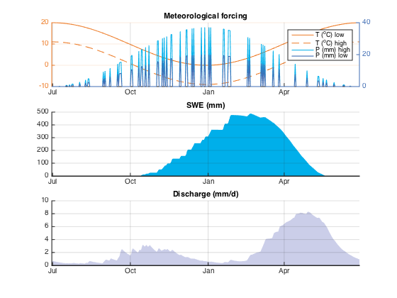

**Snow hydrology toy model**

## Contents

*   [Model setup](#1)
*   [Plot options](#2)
*   [Run model](#3)
*   [Plot some variables](#4)
*   [Plot topography and max annual SWE by elev band](#5)
*   [Plot SWE by elevation](#6)

## Model setup

<pre class="codeinput">A=10e6; % catchment area in sq m
nz=20; % nb of elev bands
zmin=2000; % elevation of the lowest elev band
zmax=3500; % elev of the top band

% band elevations linearly spaced from zmin to zmax
z=linspace(zmin,zmax,nz);
nzmax=length(zmax); % nb of increments

gfA=zeros(1,nz); % glacier fraction area per elevation band

ft=1:365*2; % forcing time vector: two years
t=ft; % computation time vector

Tlr=-0.6e-2; % temp lapse rate in dC/m (-0.6d/100m)
Plr=0.2e-3; % precip lapse rate in m-1 (0.2 km-1)
Pmax=10e-3; % max precip rate by timestep (m)
aT=20; % temp annual amplitude in dC
mT0=10; % mean annual temp at z(1) in dC

% daily temp in dC at z(1) (sinusoid of amplitude aT, mean mT0)
T0=mT0+0.5*aT*cos(2*pi*ft/365+pi);

% daily precip rate in m at z(1) (sinusoid set to zero at 80% random dates)
P0=Pmax+Pmax*cos((ft-ft(1))*2*pi/length(ft)*2);
rng(0);
y=randsample(length(ft),0.8*length(ft));
P0(y)=0;
</pre>

## Plot options

<pre class="codeinput">colSnow=[0 175 234]/255;
colRain=[64 109 180]/255;
colTemp=[237 122 37]/255;
colDisch=[203 206 233]/255;
ix=(1:365)+181; % plot only 1 water year
</pre>

## Run model

<pre class="codeinput">[P,T,swe,Qout,Qsnowtot,Qglaciertot,Qraintot,SnowMasstot,~]...
    = snowToy(A,t,ft,z,T0,Tlr,P0,Plr,gfA);
</pre>

## Plot some variables

<pre class="codeinput">figure(1),clf
snowToyPlot(1,ix,A,t,P,T,Qout,SnowMasstot,colSnow,colRain,colTemp,colDisch);
</pre>

## Plot topography and max annual SWE by elev band

<pre class="codeinput">figure(2),clf
snowToyStairs(2,ix,z,swe,colSnow);
</pre>

## Plot SWE by elevation

<pre class="codeinput">figure(2),clf
iz = 1:nz;
n=length(iz);
colSwe=cool(n);
h=plot(t,swe(iz,:)*1e3);
for i=1:n,set(h(i),'Color',colSwe(i,:));end
datetick('x','mmm')
ylim([0 inf])
xlim(t(ix([1 end])))
legend(num2str(round(z(iz))'))
title('SWE (mm)')
box off
grid
set(gca,'layer','top')
</pre>

[Published with MATLAB? R2014b](http://www.mathworks.com/products/matlab/)  

